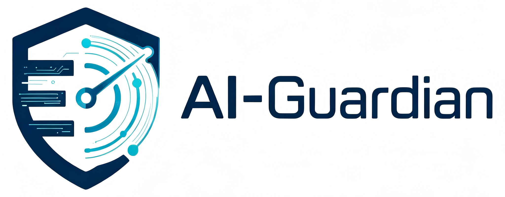

<p align="center">
  
</p>
<h1 align="center">AI-Guardian</h1>
<h3 align="center">AI-Native Security Operations Platform</h3>
<p align="center">
  <em>智能驱动 · 证据闭环 · 协同处置 · 经验沉淀</em>
</p>


<p align="center">
  
  
  
  
  
  
</p>
Agent-Driven Network Security Traffic Monitoring & Analysis Platform
The next-generation AI-powered security operations collaboration platform. It features intelligent alert triage, asset correlation, coordinated incident response, and automated report generation. This platform serves as a formidable new tool for safeguarding network operations.
---

## What is AI-Guardian

**AI-Guardian** 是一款以 **AI Agent** 为核心引擎的新一代安全运营平台。它不是简单的告警管理工具，而是一个完整的 **安全智能中枢**——从日志接入到威胁研判，从协同处置到经验沉淀，全链路由 AI 驱动。

**核心理念：** 让 AI 承担 80% 的重复研判工作，让安全人员聚焦于真正的决策。

### 与传统 SIEM/SOC 的区别

| 维度 | 传统方案 | AI-Guardian |
|:---|:---|:---|
| 告警研判 | 人工逐条分析，效率低 | AI Agent 自动研判，基于证据链生成结构化结论 |
| 日志适配 | 依赖厂商插件，扩展性差 | 可视化正则规则引擎，适配任意格式 |
| 知识沉淀 | 存在人脑中，人员流失即丢失 | STE 经验库，闭环告警自动转化为可复用知识 |
| 处置流程 | 口头协调，状态不透明 | 四阶段工作流 + 角色权限 + 消息推送 |
| 报告输出 | 手工拼凑，耗时耗力 | 模板引擎一键生成 Markdown / Excel / CSV |

---

## Architecture

```
                          ┌─────────────────────┐
                          │   AI-Guardian Web    │
                          │  React + Ant Design  │
                          └──────────┬──────────┘
                                     │ REST API
                          ┌──────────┴──────────┐
                          │  AI-Guardian Backend  │
                          │    FastAPI + ORM      │
                          │                       │
                          │  ┌─────────────────┐  │
                          │  │   AI Agent 引擎  │  │
                          │  │  LangGraph 驱动  │  │
                          │  └─────────────────┘  │
                          │  ┌────┐ ┌────┐ ┌────┐ │
                          │  │告警│ │资产│ │情报│ │
                          │  └────┘ └────┘ └────┘ │
                          │  ┌────┐ ┌────┐ ┌────┐ │
                          │  │规则│ │模板│ │报告│ │
                          │  └────┘ └────┘ └────┘ │
                          └──────────┬──────────┘
                        ┌────────────┴────────────┐
                   ┌────┴────┐              ┌─────┴─────┐
                   │PostgreSQL│              │   Redis   │
                   └─────────┘              └───────────┘
```

---

## Core Capabilities

### 🧠 AI Agent Engine
- **自主任务建模**：Agent 根据告警上下文自动规划研判步骤
- **证据检索与关联**：自动拉取资产信息、威胁情报、历史相似告警
- **结构化反思**：对研判结果自我校验，发现矛盾时主动补查
- **经验提取与复用**：闭环告警沉淀为 STE 经验，后续研判自动检索
- **多模型兼容**：OpenAI / DeepSeek / 通义千问 / 智谱 / 硅基流动 / Ollama

### 📊 Alert Lifecycle Management
- **统一解析**：原始日志 → 正则提取 → 结构化字段 → 资产关联 → 情报增强
- **智能去重**：基于 `alert_hash` 的精确去重，跨时间窗口追踪
- **四阶段流转**：监测 → 研判 → 处置 → 闭环，支持认领/指派/强制解锁
- **实时协作**：消息中心推送、认领释放机制、状态流转通知

### 🔗 Asset & Threat Intelligence
- **资产中心**：个体 + 网段资产，Excel 批量导入，自动关联告警 IP
- **威胁情报**：集成主流情报源，自动查询 IP/域名信誉
- **IP 名单**：黑白名单 + CIDR 匹配，毫秒级判定

### 📝 Reporting & Export
- **模板引擎**：消息 / Excel / CSV 模板，拖拽式字段拼接
- **报告中心**：从告警数据、运营总览一键生成结构化报告
- **Webhook**：告警到达/状态变更自动推送至企业微信、钉钉

---

## Quick Start

```bash
git clone https://github.com/HankLEE-1/AI-Guardian.git
cd AI-Guardian
cp .env.example .env
docker compose up -d --build
```

| Service | URL |
|:---|:---|
| Web Console | `http://localhost:8080` |
| API Docs | `http://localhost:8000/docs` |
| Health Check | `http://localhost:8000/healthz` |

Default admin: `admin / admin123`

> ⚠️ For production, change `JWT_SECRET`, `INITIAL_ADMIN_PASSWORD`, and API keys in `.env`.

---

## Modules

| Module | Description |
|:---|:---|
| **Dashboard** | Alert trends, status distribution, avg response time, top sources |
| **Log Parser** | Paste raw logs → auto-extract fields → asset match → save as alert |
| **Alert Workbench** | Hash search, claim/release, status flow, AI analysis, TI lookup, CSV export |
| **AI Center** | Prompt management, multi-turn analysis chat, STE experience library |
| **Asset Center** | Individual/CIDR assets, Excel import/export, owner & region management |
| **Message Center** | Workflow notifications, unread alerts, hash-based quick jump |
| **Report Center** | Create/edit/export reports from templates and operational data |
| **Rule Center** | Regex rule engine with device-level adaptation and rule generator |
| **Template Center** | Message / Excel / CSV templates with drag-and-drop field builder |
| **IP Lists** | Whitelist/Blacklist with CIDR matching, batch import/export |
| **Admin** | Users, roles, projects, devices, audit logs, task monitoring |

---

## Roles & Permissions

| Role | Scope | Key Permissions |
|:---|:---|:---|
| `admin` | System | Full access: user mgmt, force unlock, delete, global config |
| `monitor` | Monitoring | Sync alerts, parse logs, import history |
| `analyst` | Analysis | Claim alerts, AI analysis, TI lookup, escalate/close |
| `disposer` | Disposal | Claim disposal, block IPs, return to analysis, confirm closure |
| `viewer` | Read-only | View all data, no write access |

---

## Tech Stack

| Layer | Technology |
|:---|:---|
| Backend | FastAPI + SQLAlchemy + Pydantic + Alembic |
| Frontend | React 18 + TypeScript + Ant Design + Vite |
| Database | PostgreSQL 16 (Docker) / SQLite (local dev) |
| Cache | Redis 7 |
| AI Engine | LangGraph + OpenAI-Compatible API |
| Excel | openpyxl |
| Deploy | Docker Compose + Nginx reverse proxy |

---

## Demo Data

Auto-initialized on first startup:
- **Users**: `demo_analyst / demo123456`, `demo_viewer / demo123456`
- **Projects**: Red Team Exercise, Daily SOC Operations
- **Devices**: WAF, NDR, Situational Awareness Platform
- **Assets**: Portal, Trading API, DB, Endpoints, WebLogic servers, CIDR ranges
- **Rules**: Generic five-tuple + device-specific parsers
- **Templates**: Investigation report, Excel row, CSV export

> Public IPs in demo data use RFC 5737 documentation addresses.

---

## License

[Apache License 2.0](./LICENSE)

---

<p align="center">
  <b>AI-Guardian</b> — From Reactive Alert Triage to Proactive Threat Intelligence<br/>
  <sub>Built with ❤️ by <a href="https://github.com/HankLEE-1">HankLee</a></sub>
</p>
